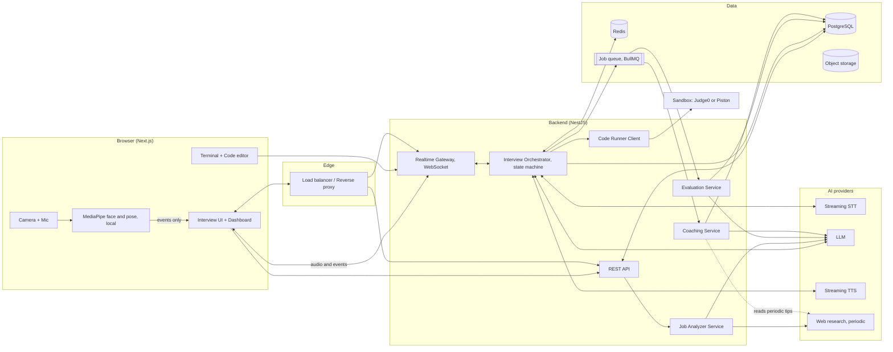
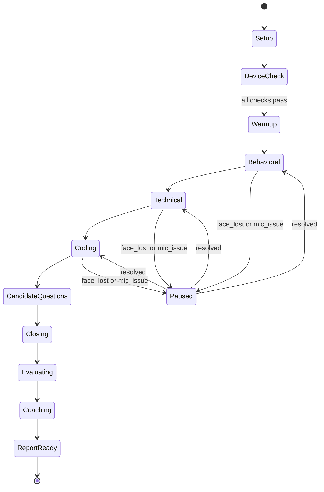

# MockRoom: System Architecture — Consolidated v2

**Project:** MockRoom, AI Mock Interview & Interview Coaching Platform
**Owner:** Abhishek
**Version:** 2.0 (22 Sep 2026) — supersedes v1.0 System Design; adds the Coaching and Job Analyzer pipelines

---

## 1. High-level architecture



## 2. Component responsibilities

| Component | Responsibility |
|---|---|
| **Interview UI (Next.js)** | Setup wizard, Job Analyzer view, device check, live room, terminal, dashboard/sidebar, report, Communication Coach, recordings, performance |
| **MediaPipe (browser)** | Face detection, landmarks, head pose; emits small events (`face_lost`, `face_found`, `gaze_off`), never raw video |
| **Realtime Gateway** | WebSocket endpoint; streams candidate audio in, interviewer audio out, and control events both ways |
| **Interview Orchestrator** | Owns the state machine; decides the next action (ask, follow up, move round, wrap up); applies the selected mode's config; builds LLM prompts with the active persona |
| **Job Analyzer Service** | Parses JD/resume into skills and a confidence profile; tags each fact `verified` / `reported` / `inferred`; triggers periodic web research for Company Simulation mode |
| **STT** | Streaming speech-to-text with interim and final transcripts and word timestamps |
| **LLM** | Interviewer brain (streamed tokens), JD/resume parser, evaluator, coaching rewriter |
| **TTS** | Streaming natural voice, fed sentence by sentence, voice matched to the active persona |
| **Code Runner** | Executes candidate code in an isolated sandbox with time and memory limits |
| **Evaluation Service** | Asynchronous post-session scoring: multi-dimensional category and per-question scores, metrics (WPM, fillers, pauses, face-visible %) |
| **Coaching Service** | Runs after evaluation; rewrites weak sections into "say it like this" versions using rubric + periodically refreshed tip library; scores practice re-attempts |
| **PostgreSQL** | Persistent data — see the TRD for the full schema |
| **Redis** | Live session state, rate limits, pub/sub between gateway instances |
| **Object storage** | Resumes, JD files, optional recordings |
| **Job queue** | Runs Evaluation and Coaching jobs after each session, and the periodic tip-refresh job |

## 3. Real-time voice pipeline

Two options; build option A first, keep option B as an upgrade.

**Option A — Chained pipeline (flexible, easier to control)**
```
Mic -> VAD -> Streaming STT -> Orchestrator -> LLM (stream) -> sentence splitter -> Streaming TTS -> Speaker
```

**Option B — Speech-to-speech realtime API (lowest latency)**
```
Mic -> Realtime speech API (handles STT + LLM + TTS) -> Speaker
```
The orchestrator still injects persona/mode instructions and receives transcripts for scoring.

**Latency budget (target, p50)**

| Step | Budget |
|---|---|
| End-of-speech detection (VAD) | 300 ms |
| Final STT transcript | 200 ms |
| LLM first tokens | 500 ms |
| First sentence to TTS audio | 300 ms |
| Network | 150 ms |
| **Total** | **~1.45 s** |

**What makes it feel human**
- Instant filler acknowledgments ("Mm-hm", "Okay, got it") while the LLM thinks.
- Sentence-level TTS streaming — never wait for the full LLM answer.
- Barge-in: VAD detects candidate speech during TTS playback and cancels both TTS and the current LLM stream.
- Short randomized pauses (0.3–0.8 s) between thoughts; persona-driven phrasing variety.

## 4. Interview state machine (mode-aware)



Each round state holds `questionsAsked`, `followUpsAsked`, `timeRemaining`, `currentQuestionId`, `difficulty`, and reads the active **mode config** (`hintsAllowed`, `interruptFrequency`, `followUpIntensity`, `thinkTimeSeconds`) and **persona** (name, tone, style) when building prompts. `Evaluating` and `Coaching` now run as two sequential queued jobs rather than one, so a report can show scores even if coaching takes a little longer.

## 5. Live warning logic

| Condition | Detection | Action |
|---|---|---|
| Face not visible | No face in MediaPipe output for 4 s | Pause timer, speak "I can't see you, could you adjust your camera?", show red banner |
| Multiple faces | More than one face for 3 s | Warn once, log event |
| Mic silent | Audio RMS below threshold for 6 s during answer window | Prompt "I can't hear you, could you check your mic?" |
| Poor network | WebSocket RTT above threshold | Show indicator; switch to lower audio bitrate |
| Long silence by candidate | No speech for 10 s | Gentle nudge: "Take your time. Would you like me to rephrase?" |

Face/pose signals are used only for these readiness checks and for the presence score category — never for personality or hireability inference.

## 6. Job Analyzer pipeline

1. User submits JD (and optionally resume) via the setup wizard.
2. Analyzer Service calls the LLM to extract role, seniority, skills (primary/secondary), and responsibilities.
3. Each extracted fact is tagged `verified` (from the JD/resume text itself), `reported` (from public interview-experience sources, only in Company Simulation mode), or `inferred` (the LLM's own reasoning about likely focus areas).
4. For Company Simulation mode only, a scoped web-research call looks up the company's public careers page and engineering content; results are cached per company for a set period rather than re-fetched every session.
5. Output renders as the skill-confidence profile (percentage bars) and feeds the Plan generator.

## 7. Evaluation pipeline

1. Session ends; the orchestrator pushes an **Evaluation** job to the queue.
2. Evaluation Service loads transcript, timestamps, terminal submissions, code results, and client-side events (face events, gaze metrics).
3. **Rule-based metrics** computed in code: words per minute, filler/hedge count, pause lengths, face-visible percentage, eye-contact percentage, tests passed.
4. **LLM rubric scoring** per question (multi-dimensional: relevance, technical accuracy, structure, specificity, confidence) and per category, returning strict JSON.
5. Scores combined using the weight table into overall score and verdict; per-question "what worked / what was missing / suggested structure" review is generated in the same pass.
6. Results stored; a **Coaching** job is enqueued automatically.

## 8. Coaching pipeline (new)

1. Coaching Service loads the evaluation output and pulls the weakest-scoring sections (starting with self-introduction if present).
2. For each weak section, it retrieves relevant entries from the `coaching_tips` table (refreshed periodically by a scheduled worker doing web research on interview-communication best practice — not fetched live per session).
3. An LLM rewrite prompt (transcript section + JD + tips + rubric) produces: the problem, the rewritten "interview version," and the reasoning — never inventing new facts, only restructuring what the candidate actually said.
4. A separate, cheap rules-based pass flags filler/hedge phrases across the whole transcript (Language Coach) using the metrics already computed in Evaluation — no extra LLM call needed.
5. Results are written to `coaching_sections`; the client is notified, and the badge count on the Communication Coach sidebar item updates.
6. When the user submits a practice re-attempt, it's scored against the original and stored in `coaching_practice_attempts`.

## 9. Data flow for one interview turn

1. Candidate speaks; browser streams audio chunks over WebSocket.
2. Gateway forwards to STT; interim text sent back for live captions.
3. VAD marks end of speech; final transcript goes to the orchestrator.
4. Orchestrator loads session state (including mode config and persona) from Redis, builds the prompt (persona, JD summary, plan, last N turns, current round, mode rules).
5. LLM streams; sentence splitter sends sentences to TTS; audio streams to the browser.
6. Turn (question, answer, timestamps) is saved to PostgreSQL asynchronously.

## 10. Scalability and deployment

- Stateless NestJS instances behind a load balancer with sticky WebSocket sessions; Redis pub/sub for cross-instance events.
- Separate worker processes for Evaluation, Coaching, JD parsing, and the periodic tip-refresh job (BullMQ).
- Sandbox runs on an isolated network or separate host.
- Containerized with Docker; CI/CD via GitHub Actions; deploy to a single VPS or Kubernetes as traffic grows.
- Observability: structured logs, per-pipeline-step latency metrics, error tracking.
